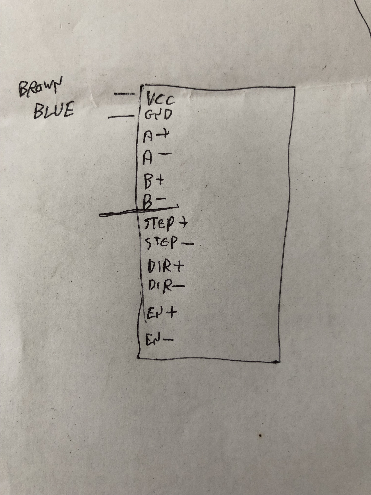
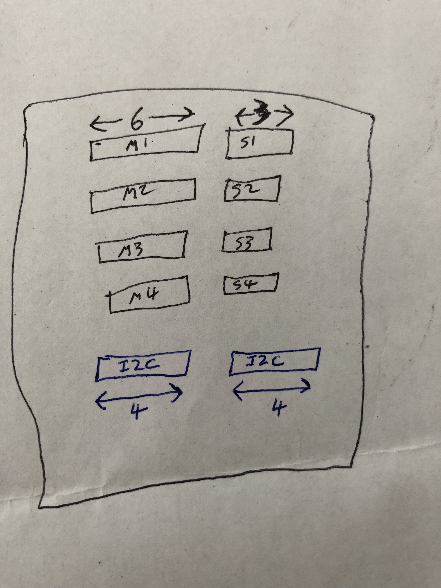

Code for controlling the large machine based on artwork by Dan Reisinger's
artwork. This machine consists of 22 vanes rotated by stepper motors.

Each stepper motor is controlled by a generic TB6600 stepper motor driver. 
The proposed scheme is to use one Arduino to control 4 drivers using the
AccelStepper library documented
[here](http://www.airspayce.com/mikem/arduino/AccelStepper/classAccelStepper.html#a4f0989d0ae264e7eadfe1fa720769fb6)
and [here](https://www.pjrc.com/teensy/td_libs_AccelStepper.html)

Each motor has a proximity sensor to detect the zero position. This sensor
requires a supply voltage. The output of the sensor is NPN normally open and
thus requires a pullup resistor. Note that the supply voltage is technically a
minimum of 6V but we have been using 5V. The pullup resistor should be tied to
5V.

The 22 motors will require 6 Arduinos, which will then communicate over I2C
with a seventh Arduino which will coordinate the display movements.

TB6600 connections:

All connections will be made using header pins and sockets. The sockets will
be mounted on an Arduino prototyping shield, and the pins will be soldered to
the wire. Connections to the TB6600 driver require 6 poles, while connections
to the position sensor require 3 poles. Thus we have the following proposed
prototyping shield layout:

Note that there are two I2C connectors; since I2C is daisychained, these are
identical connectors and can be used interchangeably. In addition to the two
I2C pins, power and ground are also provided.

Detailed wiring [instructions](doc/assemblyInstructions.docx)
