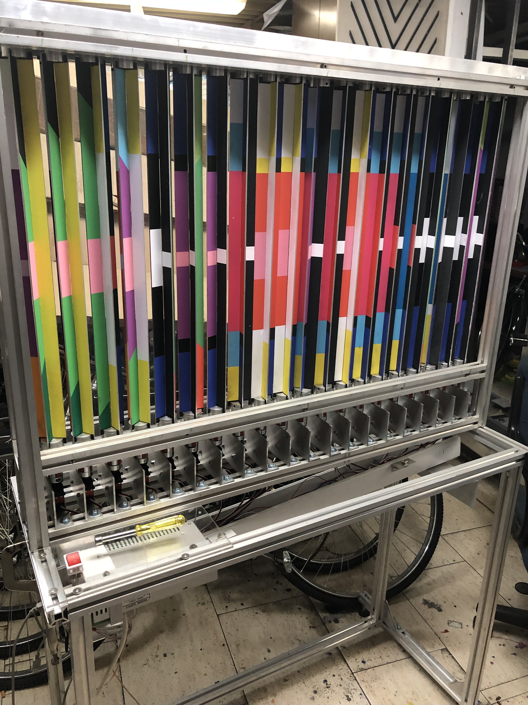
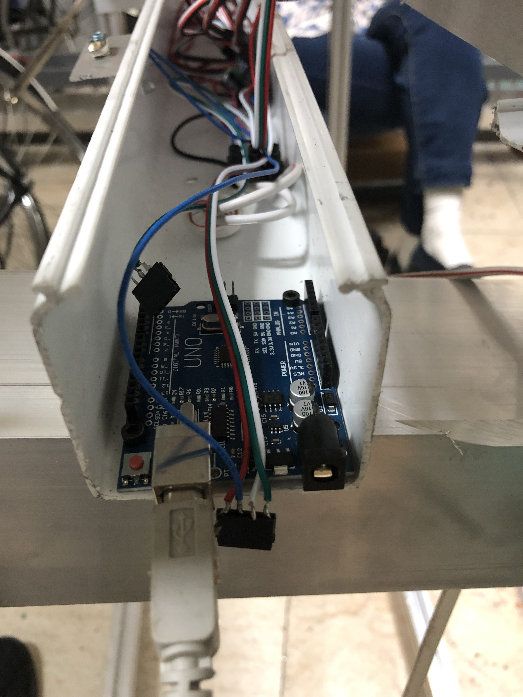
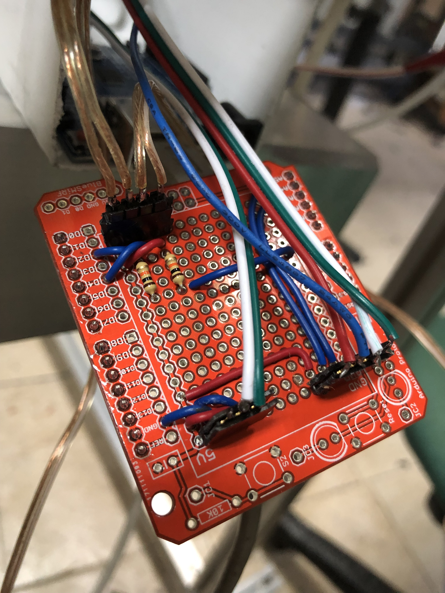

Code for controlling Didi's new machine, based on artwork by Dan Reisinger's
artwork

Overall image of the installation:

Arduino in the channel below the mechanism. The dangling connectors will
plug into the prototyping shield which will plug into the
Arduino:

Connections to the servo motor controllers, the power supply, and the switches
are made through pins on a prototyping shield:

- The 3 pin connector with only two wires (green, white) is power to the
	Arduino
- The 4 pin connector (red, blue, white, green) is communication (I2C), ground, and logic 
power to the PWM drivers (power for the servo motors comes from a separate
connector on the PWM driver)
- The 4 pin connector with the silver wires is for the two switches that will
	cause the display to run for 3 minutes

Connectors on the prototyping shield. Pay careful attention to the
orientation of the two connectors with the colored wires. 
The orientation of the far connectors with the silverish
 wires doesn't matter:
 

The PWM driver is based on the [Adafruit 16-Channel 12-bit PWM/Servo Driver -
I2C interface - PCA9685](https://www.adafruit.com/product/815)

