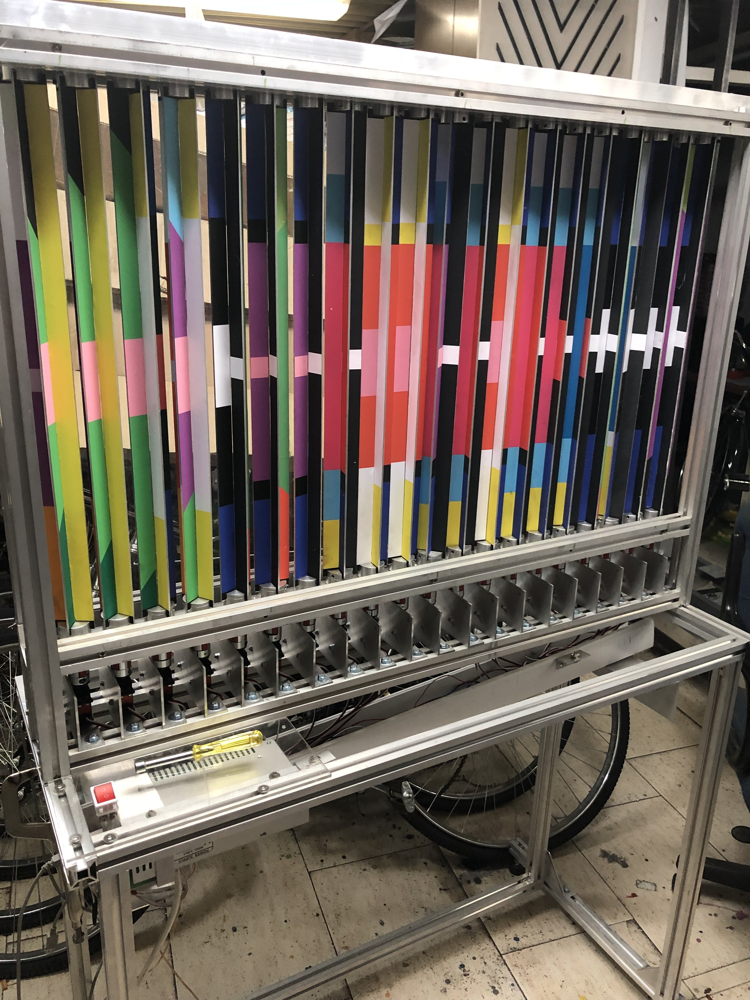
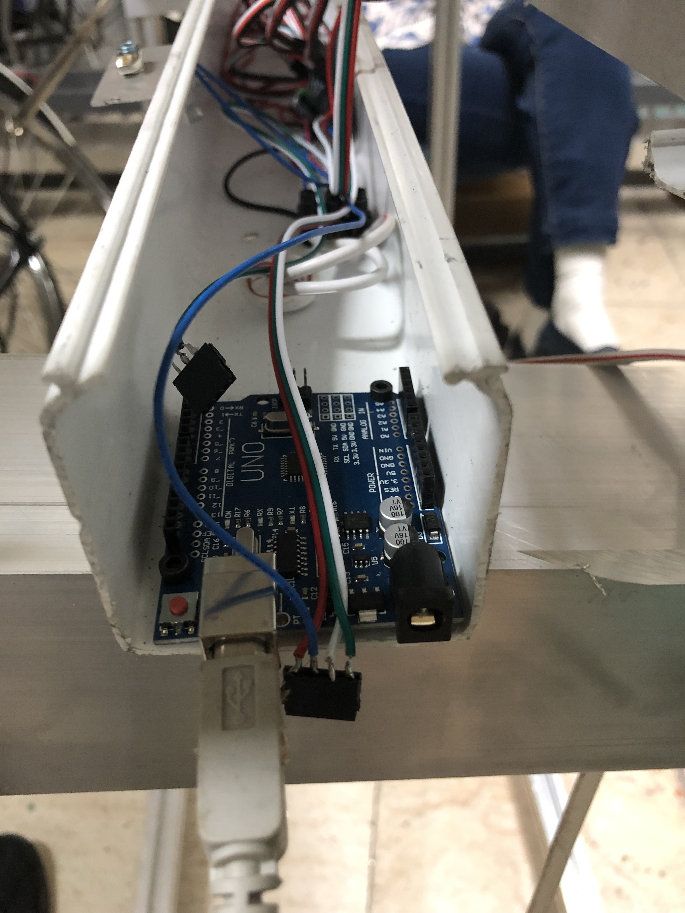
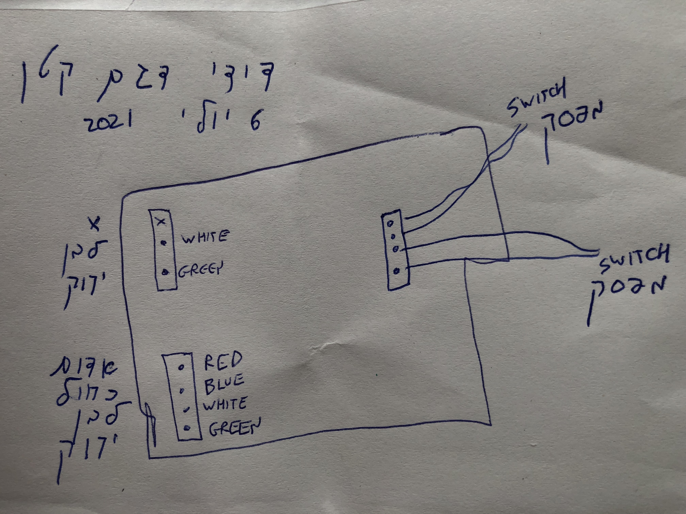
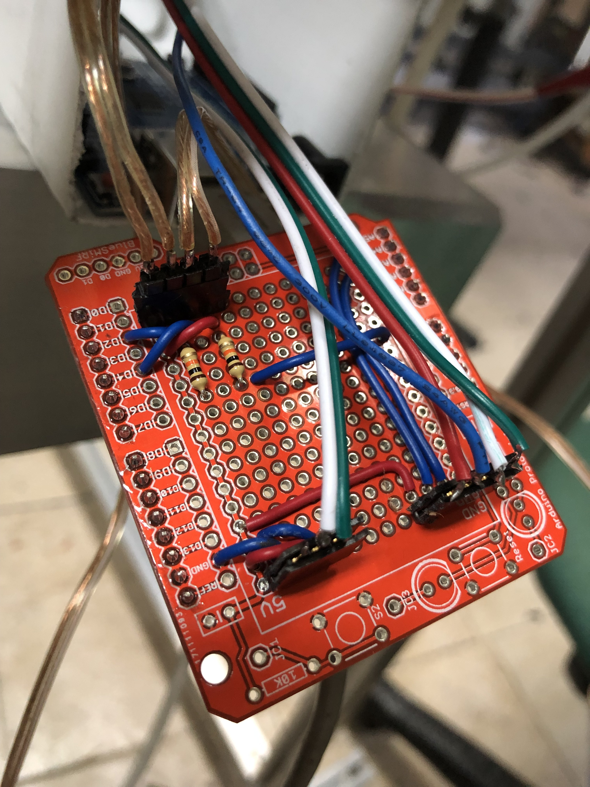

Code for controlling Didi's new machine, based on artwork by Dan Reisinger's
artwork

Overall image of the installation:

Arduino in the channel below the mechanism. The dangling connectors will
plug into the prototyping shield which will plug into the
Arduino:

Connections to the servo motor controllers, the power supply, and the switches
are made through pins on a prototyping shield:

Connectors on the prototyping shield. Pay careful attention to the
orientation of the near two connectors. The orientation of the far connectors with the silverish
 wires doesn't matter:
 
